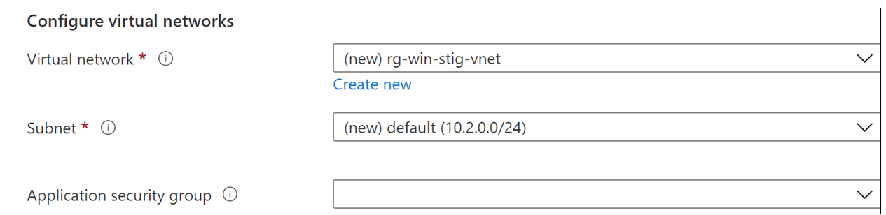

# Deploy STIG compliant Linux Virtual Machines

> Prerequisites: Azure Gov account, Storage Account (If desired, must be
> in the same resource group/region as the VM, required if you plan to
> store diagnostic log analytics), Log Analytics workspace (required if
> you plan to store diagnostic logs)

## Sign in to Azure

Sign in to the at [Azure Government portal](https://portal.azure.us/).

## Create virtual machine

1. Click on Create a resource
1. Type **Azure STIG Templates for Linux** in the search and then click on **Create**
1. In the **Basics** tab, under **Project details**

    a.  Select an existing *Subscription*.

    b.  Create a new *Resource group* or enter an existing resource group

    c.  Select your *Region*

    

1. Under **Instance details** and enter all required information

    a.  Enter the *VM name*

    b.  Select the *Linux OS version*

    c.  Select the Instance *Size*

    d.  Enter the Administrator Account *Username*

    e.  Enter the Authentication type

    f.  Enter a *Password or Public Key*

    g.  *Confirm password or Public Key*

    

1. Under **Disk**

    a.  Select the *OS disk type*

    b.  Select the *Encryption type*

    

1. Under **Networking**

    a.  Select the *Virtual Network*. Either use existing virtual
        network or select *Create new* (note RDP in bound is not
        allowed)

    b.  Select *Subnet* (ensure the default subnet is not already in
        use, utilizing an existing subnet will generate an error and
        require entering a new subnet)

    

1. Under **Management**

    a.  For Diagnostic settings select *Storage account* (optional, required to
        store diagnostic logs)

    b.  Enter Log Analytics workspace (optional, required to store
        log analytics)

    

1. Select **Review + create** to review summary of all selections

1. Once the validation check is successful Select ***Create***

1. Once the creation process is initiated you will be taken to the
    ***Deployment*** Process

    a.  **Deployment** ***Overview*** tab displays the deployment
        process including any errors that may occur. Once deployment is
        complete this tab provides information on the deployment and
        provides the opportunity to download the deployment details

    b.  ***Inputs*** ***tab*** provides a list of the inputs to the
        deployment

    c.  ***Outputs tab*** provide information on any deployment outputs

    d.  **Template** **tab** provides downloadable access to the json
        scripts used in the template

1. The completed deployment can be found on your Azure Portal homepage
    (<https://portal.azure.us/#home>) by searching on resource group and
    selecting the resource group used for the deployment. Since inbound
    RDP is not allowed, Bastion must be used to connect to the VM.

## Clean up resources

When no longer needed, you can delete the resource group, virtual machine, and all related resources.

Select the resource group for the virtual machine, then select **Delete**. Confirm the name of the resource group to finish deleting the resources.
